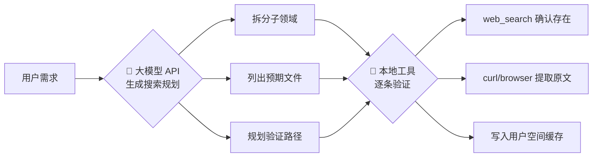

# Policy Search China — 国内政策文件搜索与引用

Search Chinese government policy documents and extract authoritative references for reports and planning documents. Covers State Council, MIIT, NDRC, SASAC, NEA, CAC and other key ministries.

## Overview

撰写央国企数智化规划/报告时，需要引用权威政策原文作为依据。本 Skill 提供从搜索定位 → 原文提取 → 引用标注的完整工作流，覆盖国务院、工信部、国家数据局、国资委、国家能源局、发改委、网信办等信源。缓存机制支持离线查找，每次搜索结果自动写入用户空间，持续积累。

## When to Use

- 用户要求在规划/报告中引用政策原文
- 用户提到某个政策文号或文件名（如"数据二十条"、"十四五数字经济发展规划"）
- 用户需要确认某个政策条款的具体表述
- 用户需要核对政策文件的发布机构、发布日期、文号
- 用户需要快速查**一句话的具体政策出处**（如"这句话出自哪个政策"、"帮我查这个说法的来源"）

**不要在以下场景使用：** 已确认无法公开获取的内部流通文件、非正式发布的地方政策征求意见稿。

## Decision Guide

| 用户需求 | 对应工作流 | 详细参考 |
|----------|-----------|---------|
| 查找某条具体政策（已知文号/文件名/关键词） | **模式一：精确查找** — 缓存 → 搜索 → 提取 → 输出 | `references/search-strategies.md` |
| 全面扫描某领域政策全景（如"近3年AI政策"） | **模式二：全面扫描** — 模型规划 → 批量验证 → 提取 → 输出 | `references/search-strategies.md` |
| 从政策原文中提取某主题内容并输出 HTML（如"算力"相关段落按篇章整理） | **主题提取→结构化输出** — 定位 → 读取 → 章节 → HTML → 验证 | `references/output-format.md` |
| 需要确认信源归属/缓存文件映射/部委域名 | **查信源体系** — 按部委确定缓存文件和搜索策略 | `references/policy-sources.md` |
| 需要排查搜索提取失败/格式问题 | **查常见问题** — 已知限制与解决方案 | `references/output-format.md` |

## Core Workflow

本 Skill 的核心工作流按六个 Phase 顺序执行：

| Phase | 操作 | 动作 |
|:-----:|------|------|
| **0** | **缓存新鲜度检查** | 扫描本地缓存最新 `searched_at` 日期，对高动态主题联网核查有无新政策 |
| **1** | **缓存搜索** | 遍历 `cache/` 目录下所有 `*.json` 信源文件，先匹配 keyword 在 title/summary/tags 中的命中，再匹配全文 |
| **2** | **原文读取** | 按条目的 `format` 字段选择读取方式：`html` 解析 pages_content 容器提取段落，`pdf` 读取配套 `.txt` 文件 |
| **3** | **关键词段提取** | 对每个段落做关键词逐段判定，记录段落编号、所属章节、原文引用 |
| **4** | **结构化输出** | 生成含逐字引文的 HTML 文件，关键词高亮标记，每文件区块含验证标签 |
| **5** | **结果验证** | 逐字比对输出引文与原文，确保无改述、无捏造 |

每步的详细操作见对应 reference 文件。输出目录通过 `POLICY_SEARCH_CHINA_OUTPUT_DIR` 环境变量配置（默认 `~/.hermes/data/policy-search-china/output/`）。

## Setup

首次加载本 Skill 时，运行初始化脚本确认目录结构就绪：

```bash
python3 scripts/init.py
```

脚本自动创建用户空间目录、输出目录，检查运行依赖（python3、curl、pdftotext），生成默认配置。

本 Skill 使用双空间架构：**系统空间**（`{skill_dir}/`，只读，随更新替换）和**用户空间**（`~/.hermes/data/policy-search-china/`，读写，永不覆盖）。搜索时用户空间优先，同文号冲突时输出对比报告供用户决策。

## Source Coverage

政策来源覆盖 **7 个部委/机构**，详见 `references/policy-sources.md`。

| 部门 | 缓存文件 | 说明 |
|------|---------|------|
| 国务院 / 中国政府网 | `gov.json` | 跨部委联合发文、综合性政策 |
| 工信部 | `miit.json` | 智能制造、两化融合、AI+制造 |
| 国家数据局 | `nda.json` | 数据要素、数据治理 |
| 国资委 | `sasac.json` | 央国企数字化转型 |
| 国家能源局 | `nea.json` | 能源数智化、智能煤矿 |
| 发改委 | `ndrc.json` | 新基建、算力、双碳 |
| 网信办 | `cac.json` | AI 监管、数据安全 |

## Two-Stage Workflow Principle

> **🤖 大模型 API** = 调用 provider 模型完成：需求理解、领域拆解、搜索规划、结果整合
> **🔧 本地工具** = Hermes Agent 执行：`web_search` / `curl` / `browser_navigate` / `read_file` / `write_file` 等

**关键教训：** 全面扫描某领域时，不要从工具搜索开始。先调用大模型 API 生成搜索规划（拆子领域、列预期文件、规划验证路径），再用本地工具逐条验证——覆盖面远高于"想到什么搜什么"。



## Common Pitfalls

| # | 问题 | 解决方案 |
|---|------|---------|
| 1 | gov.cn 搜索返回过时政策 | 搜索时嵌入年份限定，引用前做时效性检查 |
| 2 | web_extract 在 gov.cn 返回残缺内容 | 切换到 `browser_navigate` + `browser_snapshot(full=true)` |
| 3 | 同名政策多个版本 | 检查文号、发布日期、发文机关三重确认 |
| 4 | 国资委网站搜索结果时效性差 | 改用 `site:gov.cn 国资委 领域关键词` |
| 5 | 引号配对与中英文混用 | 政策原文使用中文弯引号 `“”`，文号括号用中文括号 `（）` |

更多已知限制（PDF 扫描件、web_extract 后端限制、缓存滞后性等）见 `references/output-format.md`。

## Verification Checklist

- [ ] 搜索到的政策与需求匹配：部门、领域、时间范围三项一致
- [ ] 政策原文已从官方源提取（优先 gov.cn / 部委官网）
- [ ] 引用条款逐字核对原文，无转述/概括
- [ ] 时效性确认：2022 年后的政策（或确认更早政策未被废止）
- [ ] 引用格式完整：文件名、文号、发布机关、发布日期、原文地址
- [ ] 原文地址可访问且为官方源（非转载）
- [ ] 缓存已写入：新提取的政策已追加到对应信源的缓存文件（`{skill_dir}/cache/*.json`）
